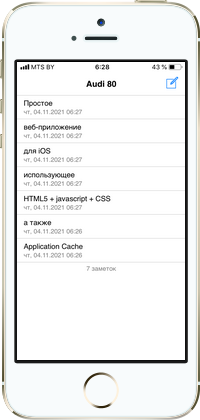

# auto-notes
Простое HTML5 приложение (WebApp) заметок для iPhone 5s в оффлайн режиме

## Демонстрация в браузере
[auto-notes](https://by-arriva.github.io/auto-notes/)
## Зачем
Я люблю всё в своей жизни упорядочивать - списки задач, заметки - это прям моё. Имея во владении древнее ведро с болтами (машину), приходится записывать все проблемы с машиной, т.к. озвученая проблема - это половина пути к её решению. Стандартная программа заметок в моём iPhone 5s слишком громоздкая, захотелось сделать свою. Да так, чтобы выглядела она не хуже, всякие там анимации, жесты... Не затрагивая профессиональную iOS разработку, простейший способ создания приложений - PWA (прогрессивное веб-приложение). На iPhone это дело поддерживается весьма скверно, но всё еще работает так называемое WebApp (Web Application, HTML5 + appcache manifest).\
По сути, это обычная веб страница, сохраненная на главный экран телефона. Отличие лишь в том, что интерфейс Safari скрыт, а страница остается функциональной при отсутствии интернета.
## Как установить на главный экран телефона
- В своем iPhone в Safari перейти по [адресу](https://by-arriva.github.io/auto-notes/)
- Нажать "Поделиться" снизу
- Нажать "На экран Домой"
- Нажать "Добавить"
- Запустить появившееся приложение
## Как пользоваться
При использовании приложения, сетевое подключение не нужно
- Чтобы добавить заметку:
    - нажать "Новая заметка" сверху справа
    - написать текст заметки
    - нажать "Готово"
- Чтобы удалить заметку:
    - смахнуть заметку влево
    - нажать "ОК"
- Чтобы выделить заметку:
    - смахнуть заметку вправо
- Чтобы переместить заметку:
    - долгий тап по нужной заметке
    - заметка выделилась серым
    - выбрать заметку, на место которой надо вставить нужную
- Чтобы экспортировать все заметки в текстовый файл:
    - нажать "Новая заметка" сверху справа
    - написать "backup"
    - нажать "Готово"
    - нажать "экспорт"
    - выделить весь текст
    - нажать "Поделиться..."
    - Скопировать в Documents или Сохранить в Файлы
- Чтобы импортировать заметки из этого текстового файла:
    - нажать "Новая заметка" сверху справа
    - написать "backup"
    - нажать "Готово"
    - нажать "Выбрать файл"
## Прочая информация
Некоторые специфичные для Safari css стили, которые я использовал:\
    -webkit-touch-callout: none - чтобы убрать меню при длительном нажатии ссылки\
    -webkit-text-size-adjust: none - чтобы отключить автоматическое масштабирование страницы\
    -webkit-user-select: none - чтобы отключить возможность выделения текста\
    -webkit-tap-highlight-color: transparent - чтобы отключить выделение ссылки цветом при нажатии\
    -webkit-hyphens: auto - автоматическая расстановка переносов\
Ну и напоследок одна очень неприятная особенность подобного рода приложений. Спустя какое-то время работы оффлайн, программа перестает работать, требуя интернет. В моем случае будет грустный смайлик (404.html) и кнопка back, которая работает лишь в половине случаев. Бороться с этим можно так: с включенным интернетом необходимо принудительно обновить страницу приложения. Как мы помним, интерфейса браузера нет, нужно при создании новой заметки ввести "backup", нажать "Готово", нажать "назад и обновить". Можно это сделать несколько раз
